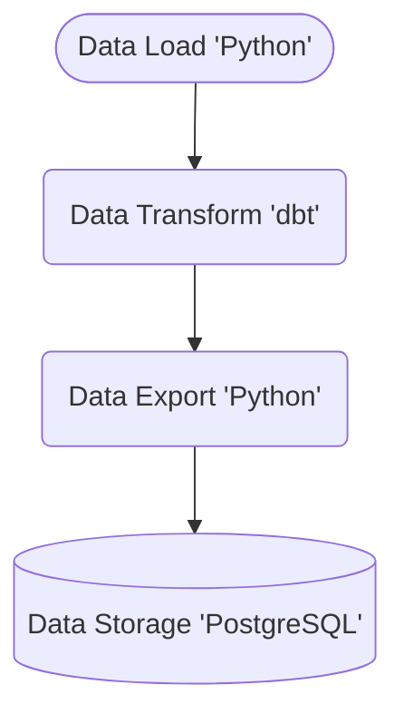

# Data Analysis with Covid Data

Final Data Engineering Task for OTA

## Getting Started

These instructions will get you a copy of the project up and running on your local machine for development and testing purposes.

### Prerequisites

The things you need before installing the software.

* Docker Engine
* PostgreSQL
* Git

### Installation

A step by step guide that will tell you how to get the development environment up and running on Windows.
Open a terminal and run the commands below.

```
git clone https://github.com/pioesmeria/data_task.git data-task
cd data-task
cp dev.env .env
rm dev.env
```

### Dataset

Our dataset will come from the COVID-19 Data Repository by Johns Hopkins University.
Do the step below to fetch the required dataset for this project.

```
git clone https://github.com/CSSEGISandData/COVID-19.git data-task/dataset
```

You should have a folder named 'dataset' under 'data-task'.


### .env File

In the .env file, change the value of the following code to your specification:

```
POSTGRES_DB=
POSTGRES_PASSWORD=
POSTGRES_SCHEMA=
POSTGRES_USER=
```

### Running Mage.AI

On your terminal, under the root project folder where docker-container is located, execute the docker command below:

```
docker compose up
```

Once the server is running, go to http://localhost:6789 to view Mage.AI tool.

## Technology Used

Below are the technology I used for this project:

* Mage.AI - Mage.AI made it easy for me to met the requirements of this project. Mage AI is already integrated with the tools I used like dbt and python.
* dbt - I utilized dbt for data transformation, capitalizing on its SQL-based approach and automated testing features. My familiarity with SQL streamlined the transformation process, allowing me to efficiently leverage dbt’s capabilities to ensure accurate and reliable data outputs.
* duckDB - I utilized DuckDB as the engine for data transformation in dbt, leveraging its superior performance to handle large datasets with remarkable efficiency. DuckDB's faster query execution significantly accelerates the process, making it exceptionally valuable given the size of the dataset.
* PostgreSQL - I chose PostgreSQL for data storage in this project due to its seamless integration with Mage.AI, which streamlined the data management process. Additionally, I leveraged PostgreSQL’s visualization tools to enhance data insights and facilitate more effective analysis.
* Python - In this project, I leveraged Python's pandas library to efficiently fetch and merge all the CSV files within the dataset. Pandas' powerful data manipulation capabilities made it straightforward to handle and integrate the data seamlessly.
* Docker - Docker is a tool that allowed me to run Mage in a containerized environment. 
* Github - Our ever-reliant repository
* Visual Studio Code - Even though Mage.AI has a code editor, I still use VS Code since I'm already accustomed to it. 

## Data Pipeline Design

The design I made for my pipeline is based on ETL (Extract - Transform - Load)

Getting the dataset:
 - I used Mage.AI's data load block to retrieve all the CSVs in the dataset. I've used python as the programming language, as mentioned above I leverage Pandas library for the data retrieval.

Transforming the data:
 - I used dbt, which is already integrated in Mage.AI to transform the data into a more readable and insightful format. This integration facilitated efficient data processing and ensured clarity in the transformed datasets.

Exporting the data:
 - I utilized Mage.AI's data exporting block to export the data into Postgres which is hosted on a local machine. 

Below is a flowchart of the design of the data pipeline I made. You can view the pipeline on the Mage AI environment for more details. 



## My answers to the following data analysis questions

What are the top 5 most common values in a particular column, and what is their frequency?
*  Using the country column as the basis and the number of active column as the metric, the top 5 Country with 0 active cases are as follows:

| Country  | Frequency |
| ------------- | ------------- |
| Us  | 310  |
| China  | 117  |
| United Kingdom  | 69  |
| Canada   |  46  |
| New Zealand  | 24  |

The query I used is:
```sql
SELECT 
  country,
  count(*) 
FROM covid_data.global_covid_data 
WHERE num_of_active = 0 
GROUP BY 1
ORDER BY 2 DESC
```

How does a particular metric change over time within the dataset?
*  According to John Hopkins Hospital, the number of Active cases is equal to the difference between total of cases, number of death, and number of recovered. So by doing the query below and using pgAdmin4's Graph Visualizer, we can see that the number of active cases changes in accordance to the number of deaths and recovered. 

```sql
SELECT 
  _date, 
  SUM(num_of_active) AS active, 
  SUM(num_of_deaths) AS death, 
  SUM(num_of_recovered) AS recovered
FROM covid_data.us_covid_data
GROUP BY 1
ORDER BY _date;
```

Is there a correlation between two specific columns? Explain your findings.
* I used the number of confirmed cases and number of deaths in the US dataset. In pgAdmin4, I query the code below and the result of their correlation is 0.95. This means that for every increase of confirmed cases, the number of deaths also increases.

```sql
SELECT
  corr(num_of_confirmed, num_of_deaths)
FROM covid_data.us_covid_data;
```


